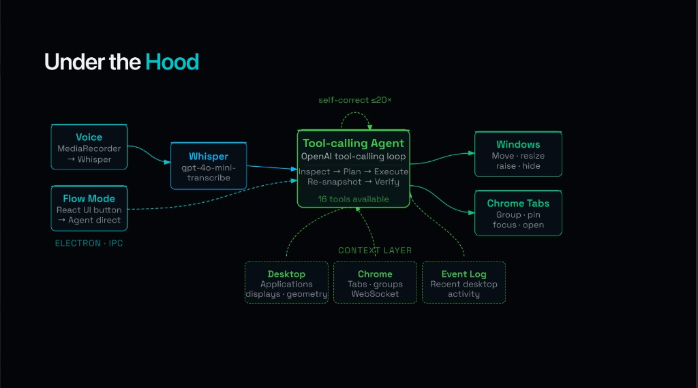

# FlowOS — your Mac's menu-bar desktop copilot

> Talk to your menu bar. Watch your desktop snap into place.

FlowOS lives as a small icon in your macOS menu bar. Click it and a dropdown appears with **Start Tracking**, **Enter Flow State** (which expands into Coding Mode / Research Mode / Auto), and **Toggle Mic**. Hit the mic and tell it what you want — *"split my screen with Cursor, Chrome, Terminal, and Slack"*, *"move Chrome to my second display and group my tabs by topic"*, *"split-screen my two most recently used apps"* — and it does it.

Under the hood, an OpenAI tool-calling agent reads a live snapshot of your desktop (every app, every window, every display, every Chrome tab) and drives a native Swift helper plus a Chrome extension to act on it. Voice in, real action out, in seconds.

## What It Does

- **Lives in your menu bar**: Click the FlowOS icon for instant access — start tracking, drop into a focus mode, or toggle the mic. Same controls also live in the floating renderer window if you'd rather click around.
- **Hotkey, then talk**: Hit **⌘⇧K** anywhere on macOS, *speak your request*, then hit **⌘⇧K** again to send. While you're talking the floating control window pops open and glows red (red ring + soft red shadow + animated red dot) so you always know FlowOS is listening. No window to switch to, no button to find — just the keyboard, your voice, and the keyboard again.
- **Voice commands**: Speak naturally and the agent figures out the moves — Whisper transcribes, the OpenAI agent plans against a live snapshot of your desktop, the windows tile. A few that actually work today:
  - *"Put me in Coding Mode."* → splits Cursor and GitHub Desktop side-by-side on your primary display, pushes every Chrome window to your second display, minimizes Slack / Discord / Mail. ~3-5 seconds end to end.
  - *"Move my Chrome to my second display and group all my tabs by category."* → relocates Chrome to display 2 at full visible-rect size, then takes 30+ ungrouped tabs across multiple Chrome windows and topic-groups them ("Auth", "React", "Hackathon", "Later") without losing one.
  - *"Open 5 tabs to help me learn dynamic programming, the STAR method, and hashmap YouTube videos."* → opens five tabs in a fresh Chrome window and groups them by topic.
  - *"Split screen my two most recently used applications."* → reads the rolling 50-event tracking buffer, picks the two most recent `app.activated` events, and tiles those windows on the focused display.
  - *"Bring back Slack on the iPad."* → unhides Slack and moves it to the connected Sidecar display, sized to that display's visible rect.
- **Three Flow Modes** (under the **Enter Flow State** menu):
  - **Coding Mode** — IDE (Cursor / Xcode / VS Code) and a coding helper (GitHub Desktop / Codex / Terminal) split-screen on your primary display, every Chrome window pushed to your second display (or hidden if there isn't one), everything else minimized.
  - **Research Mode** — Chrome and a writing companion (Notes / Bear / Obsidian) split-screen on your primary display, an optional grounding app (Spotify / Apple Music) on the second display *only if it's already running*, distractors minimized.
  - **Auto** — requires tracking. Reads the rolling 50-event tracking summary, infers whether your recent activity looks like coding or research, and runs the right playbook. Press it without tracking and FlowOS pops a native dialog asking you to start tracking first instead of guessing.
- **Multi-display window management**: Move, resize, raise, focus, minimize, hide, and unhide windows across every connected display — including Sidecar / iPad — using the per-display *visible* rect (menu bar and Dock excluded).
- **Geometry-aware tiling**: Layouts are computed against the target display's `visibleX/Y/Width/Height` in macOS's global coordinate space, so windows fit cleanly on whichever monitor you point them at — internal Retina, external 4K, Sidecar iPad, all scaled per-display.
- **Deterministic two-window split**: A dedicated `split_two_windows` tool computes left/right cells server-side (with optional gap and margin) and applies them in a single atomic frame write per window — no LLM math, no drift.
- **Chrome tab control**: Focus tabs, group tabs by topic, ungroup, pin, open new tabs — across every Chrome window. Closing tabs is intentionally **not** exposed (safety).
- **Intelligent grouping**: Flow Mode topic-groups Chrome tabs across multiple Chrome windows and consolidates related work without losing anything.
- **Live state context**: A 50-event ring buffer of native events (app launches/quits/activations, display add/remove) and a fresh system + Chrome snapshot are pre-injected into every voice / Flow run so the agent always knows current desktop state.
- **Self-correcting agent loop**: Up to 20 iterations of OpenAI tool calling, with automatic re-snapshots after long mutation chains so the model never plans against stale state.

## Requirements

- macOS (Apple Silicon or Intel)
- Node.js 20+ and npm
- Swift toolchain (Xcode command line tools — `xcode-select --install`)
- Google Chrome (for the browser-control extension)
- An OpenAI API key with access to `gpt-4o`, `gpt-4.1`, or `gpt-5`, and the Whisper transcription endpoint


## Setup


### Step 1: Clone and install

```bash
git clone https://github.com/<you>/FlowOS.git
cd FlowOS
npm install
```

### Step 2: Configure environment

Copy `.env.example` to `.env` and fill in your OpenAI key:

```bash
cp .env.example .env
```

```env
OPENAI_API_KEY=sk-...
OPENAI_MODEL=gpt-4o            # gpt-4o / gpt-4.1 / gpt-5 — anything with >8K context
FLOWOS_WS_PORT=7331
```

> If you set `OPENAI_MODEL=gpt-4` you will hit context-length errors — that legacy model only has 8K tokens and the snapshots we inject are larger than that. Use `gpt-4o` or newer.

### Step 3: Build the Swift native helper

The Swift helper is what actually moves your windows via the macOS Accessibility API.

```bash
npm run build:swift-helper
```

This runs `swift build` against `swift-helper/Package.swift` and produces `swift-helper/.build/debug/FlowStateHelper`, which Electron's helper bridge auto-discovers on launch.

> If you skip this step, Electron will fall back to `swift run` on first launch and rebuild the helper from source — it works, just slower the first time.

### Step 4: Build the Chrome extension and load it

The Chrome extension is what gives FlowOS access to your tabs, windows, and groups. It connects back to Electron over a local WebSocket on port `7331`.

1. Build the extension:
  ```bash
   npm run build --workspace @flowos/extension-chrome
  ```
   This produces `extension-chrome/dist/`.
2. Open Chrome and go to `chrome://extensions`.
3. Toggle **Developer mode** on (top-right).
4. Click **Load unpacked** and select the `extension-chrome/dist` folder.

The extension will start broadcasting tab snapshots to FlowOS as soon as Electron is running.

### Step 5: Build everything else and launch

The simplest path is the root dev script, which builds shared types + Electron in watch mode, runs Vite for the renderer, and boots Electron once both are ready:

```bash
npm run dev
```

Or, for a one-shot production build of every package:

```bash
npm run build
```

### Step 5b: Make sure the menu-bar icon can actually appear

Whatever shell or IDE you launched `npm run dev` from (Terminal, iTerm2, Warp, Cursor, VS Code, etc.) is the parent process for FlowOS during development, and macOS gates menu-bar items behind a per-app toggle. If your parent app is toggled off there, the FlowOS tray icon silently fails to appear.

Open **System Settings → Allow in the Menu Bar** and make sure your terminal / IDE is toggled **on**:

> *Applications can add menu bar items to provide extra functionality such as launching a utility or performing tasks when the application isn't open. Turning off a menu bar item will prevent it from ever appearing in the menu bar.*

If you use a menu-bar manager like Bartender or Hidden Bar, double-check it isn't auto-hiding the FlowOS icon either.

Quick sanity check: with the app running, the FlowOS icon should appear in the right side of your menu bar. Clicking it gives you Start Tracking / Enter Flow State / Toggle Mic / Quit.

### Multi-monitor alignment note

When using multiple monitors, make sure your monitors are horizontally aligned in macOS Display Settings. In other words, the displays should share the same bottom y-axis position.

FlowOS moves windows using macOS global screen coordinates. If two displays are not aligned on the same horizontal axis, a window moved to the secondary display can be placed partially above or below the visible coordinate area. This can make the app appear cut off, with only part of the window visible.

For the most reliable testing setup, open **System Settings → Displays → Arrange**, then drag the displays so their bottom edges line up.

### Quick sanity checks

```bash
npm run typecheck    # full repo typecheck
```

If the voice button greys out with "Voice capture is not available", your Electron build is missing microphone entitlement — restart `npm run dev`. If you don't see a FlowOS icon in your menu bar at all, see Step 5b above — your shell/IDE is probably toggled off in **System Settings → Allow in the Menu Bar**.

## Architecture

```text
                     🎙️ Speech In                🟢 Mode Button
                          │                            │
                          ▼                            │
              MediaRecorder (renderer)                 │
                          │                            │
                          ▼                            │
                OpenAI Whisper (STT)                   │
                       whisper-1                       │
                          │                            │
                          └────────────┬───────────────┘
                                       │
                                       ▼
                        ┌──────────────────────────────┐
                        │       OpenAI Agent Loop      │
                        │   GPT-4o / GPT-5 · ≤20 iters │
                        │      function calling        │
                        └──────────────┬───────────────┘
                                       │
       ┌────────────────┬──────────────┼──────────────┬──────────────┐
       │                │              │              │              │
   System          Chrome         Tracking       Tool calls       Tool calls
   Snapshot        Snapshot       Summary
   (apps/windows/  (tabs/windows/ (50-event       │              │
    displays)       groups)       ring buffer)    ▼              ▼
       ▲                ▲              ▲     Swift Native   Chrome Extension
       │                │              │     Helper         (Manifest V3
       │                │              │     (AX API,        + WebSocket)
       │                │              │      AppKit,             │
       │                │              │      CoreGraphics)       │
       │                │              │           │              │
       │                │              │           ▼              ▼
       │                │              │   🖥️ Window         🌐 Tab
       │                │              │      management        management
       │                │              │   move · resize    focus · pin
       │                │              │   raise · focus    open · group
       │                │              │   minimize · hide  ungroup
       │                │              │   per-display      (never close)
       │                │              │   visible-rect
       │                │              │   tiling
       │                │              │
       └─ live ─────────┴──── live ────┘
          snapshots             native events
```

The app follows a multi-process Electron architecture — one menu-bar tray icon up top, four cooperating processes underneath:

```
FlowOS/
├── electron/                     Main process: orchestrator, IPC, helper bridge,
│                                 agent loop, tracking session, Whisper transcribe
│   └── src/services/openaiFlowOrchestrator.ts   ← agent loop + tool definitions
├── renderer/                     React + Vite UI: voice button, Flow Mode button,
│                                 mic capture via MediaRecorder
├── swift-helper/                 Native macOS helper (Swift 5)
│   └── Sources/FlowStateHelper/  AXUIElement, NSScreen, JSON-RPC over stdio
├── extension-chrome/             Manifest V3 extension (tabs, tabGroups APIs)
└── shared/                       Shared TypeScript contracts: SystemSnapshot,
                                  ChromeSnapshot, NativeEventEnvelope, etc.
```

## Operation Flow

1. User triggers a run from the menu bar — either **Toggle Mic** to speak (mic → MediaRecorder → IPC → Whisper) or **Enter Flow State → Coding / Research / Auto** to drop into a one-click focus mode. Same actions are also available in the floating renderer window.
2. The orchestrator captures fresh context: a `system.snapshot` from the Swift helper (apps + windows + every display's geometry), the latest `chrome.snapshot` from the extension, and the rolling 50-event tracking summary.
3. All of that context is pre-injected into the user prompt alongside the transcript or Flow Mode directive.
4. The agent loop calls OpenAI with the prompt and the tool schema (`get_system_snapshot`, `move_window`, `resize_window`, `set_frame`, `split_two_windows`, `raise_window`, `minimize_window`, `restore_window`, `activate_app`, `hide_app`, `unhide_app`, `get_chrome_snapshot`, `focus_chrome_tab`, `group_chrome_tabs`, `ungroup_chrome_tabs`, `pin_chrome_tab`, `open_chrome_tab`).
5. Each `tool_use` is dispatched by the Electron main process to the right backend: window/display tools go to the Swift helper over JSON-RPC stdio, Chrome tools go to the extension over WebSocket, and a few tools (snapshots, deterministic split layouts) are computed inside Electron itself before being returned as `tool_result`.
6. Tool results flow back as a `tool_result` message; the agent loops up to 20 iterations, re-snapshotting periodically as state mutates.
7. When the agent has nothing left to do it returns a plain-English summary, which the renderer displays.

## Built With

- **Electron 36+** — multi-process desktop shell, IPC via `contextBridge`, frameless transparent control window
- **TypeScript** — main process, renderer, Chrome extension, shared contracts
- **React + Vite** — renderer UI (voice button, Flow Mode, status)
- **Swift 5** — native helper using AppKit, Accessibility API (`AXUIElement`, `kAXRaiseAction`, `kAXPosition`, `kAXSize`), CoreGraphics, `NSScreen`
- **OpenAI Chat Completions** — agent loop with function calling on GPT-4o / GPT-4.1 / GPT-5 (configurable via `OPENAI_MODEL`)
- **OpenAI Whisper** — speech-to-text via `whisper-1`
- **MediaRecorder API** — in-renderer audio capture (replaces the `webkitSpeechRecognition` path that does not work in Electron)
- **Chrome Extension (Manifest V3)** — `chrome.tabs`, `chrome.tabGroups`, `chrome.windows`, talking to Electron over a local WebSocket
- **WebSocket** — `ws://localhost:7331` event bus between Electron and the extensions
- **JSON-RPC over stdio** — Electron ↔ Swift helper protocol
- **npm workspaces** — monorepo across `electron`, `renderer`, `extension-chrome`, `shared`

## Future Roadmap

- Layout memory: remember and replay learned per-task layouts
- Cross-platform Windows path via `node-window-manager`

## Diagram



## Demo Video

[](https://youtu.be/h011ZfVjL3E)

> Make sure to unmute — half the magic is hearing the command go in and watching the windows snap into place.
